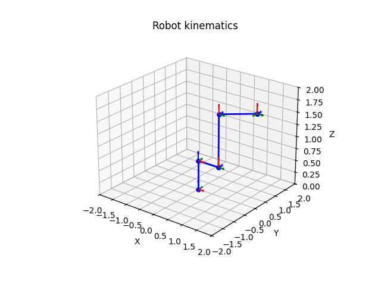
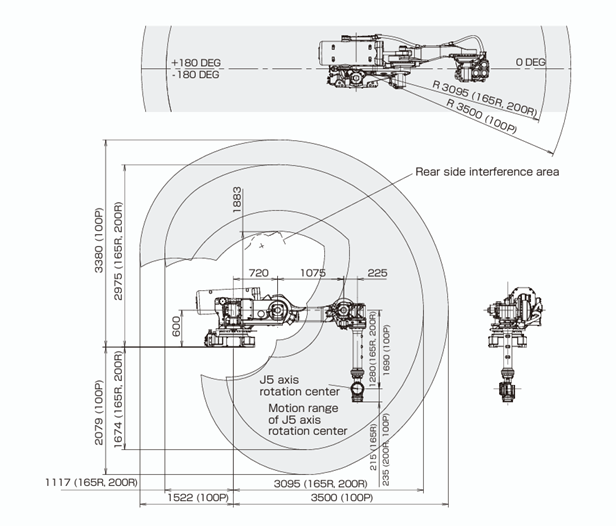
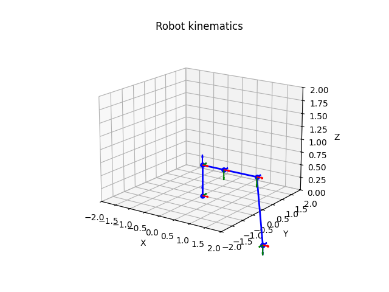

# Kinematic Chain Visualizer for Manipulator Robots

This repository contains a simple Python application to visualize the kinematic chain of manipulator robots using `.geo` XML files generated by Renishaw modeling tools.

## Overview

The script parses the `.geo` XML file and extracts the relevant kinematic parameters for each joint and link in the robot. These parameters are then used to generate the Denavit-Hartenberg (DH) table, which is used to construct a 3D graphical representation of the robot's structure.

When performing calibration with Renishaw equipment, it is crucial that the robot model is accurately defined. An incorrect or incomplete model can lead the generated program to move the robot into unexpected or even hazardous positions. This visualization tool helps validate the correctness of the model before deploying it in a real calibration procedure.

## DH Parameter Extraction
The XML `.geo` file defines a complete model of the robot, including joint types, link dimensions, and orientations. For each link defined in the model, the script looks for `<Link_RotaryAxis>` elements, and from each of these, it extracts the parameters found under the nested structure:
```xml
<LinkParameters>
  <AllElements>
    <Parameter>...</Parameter>
  </AllElements>
</LinkParameters>
```
After multiple tests — and due to the lack of official documentation explaining the meaning of each parameter — it has been concluded that the relevant parameters for constructing the DH table are **A, r, d, T**. These can be related to the standard Denavit-Hartenberg parameters as follows:
- **A -> α (alpha):** The twist angle between consecutive z-axes, measured around the x-axis.
- **r -> d:** The offset along the z-axis.
- **d -> r:** The distance along the x-axis between two joint axes.
- **T -> θ (theta):** Representing a rotational offset around the z-axis.

An example of a generated DH table might look like this:

### 📋 DH Parameter Table

| Joint |     A(α)  |  r(d) |  d(r) |    T(θ)    |
|-------|-----------|-------|-------|------------|
| 01    | 0.0000    | 0.6000| 0.0000| 0.0000     |
| 12    | -1.5708   | 0.0000| 0.7200| -1.5708    |
| 23    | 0.0000    | 0.0000| 1.0750| 0.0000     |
| 34    | -1.5708   | 1.2800| 0.2250| 0.0000     |
| 45    | 1.5708    | 0.0000| 0.0000| 0.0000     |
| 56    | -1.5708   | 0.0000| 0.0000| 0.0000     |

> **Note:** All values are in radians (for angles) and meters (for distances), based on the parameter mapping from the `.geo` model.

## Visualization

The script uses `matplotlib` to render the robot's kinematic chain in 3D. This provides an intuitive view of the robot's structure based on its DH configuration.

<p align="center">
  
</p>
<p align="center"><em><strong>Figure 1:</strong> Kinematic chain visualization of the FANUC R-2000iB/200R model</em></p>

This example corresponds to the model of the **FANUC R-2000iB/200R** robot, created using Renishaw's model generator. 

As shown in the image above, the visualization differs from the actual physical configuration of the robot — highlighting how an incorrectly defined model during calibration may lead to inaccurate or unexpected joint positions in real-world execution.

<p align="center">
  
  
</p>
<p align="center"><strong>Figure 2a:</strong> Diagram of the <em>R-2000iB/200R</em> robot in its zero position. <strong>Figure 2b:</strong> Corrected kinematic chain visualization of the <em>R-2000iB/200R</em>.</p>

The tool was used to identify inconsistencies in the original model and to adjust the kinematic parameters accordingly. As shown in **Figure 2b**, the corrected visualization reflects a  kinematic structur aligned with the real configuration of the robot.

## How to Use

1. Clone this repository.
2. Make sure your `.geo` file is placed in the root directory (or in `models` folder).
3. Run the script using one of the following options:

### 📌 Option 1: Provide the file path as a command-line argument

```bash
python visualizer.py your_model_filepath.geo
```

### 📌 Option 2: Manually set the file path in the script
If you prefer not to pass the path from the command line, you can modify the `filepath` variable directly inside the script. For example:
```py
# Replace with your geomodel path 
filepath = "your_model_filepath.geo"
```
Then simply run:
```bash
python visualizer.py
```

> ⚠️ **Note:**  
> This repository also includes a prototype Streamlit application (`app.py`).  
> The goal of this app is to eventually provide a more intuitive and flexible interface for generating and editing robot models.  
> Currently, it allows users to modify kinematic parameters dynamically and visualize the changes in real time.  
> However, the app is still under development and not fully debugged — use with caution.

